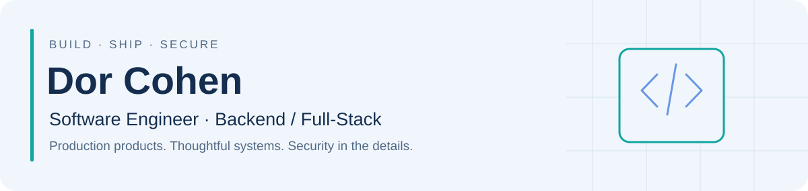
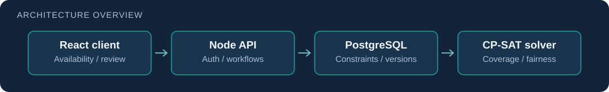
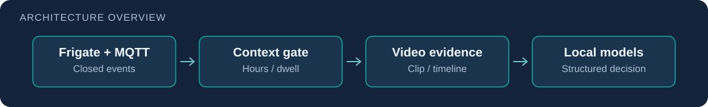
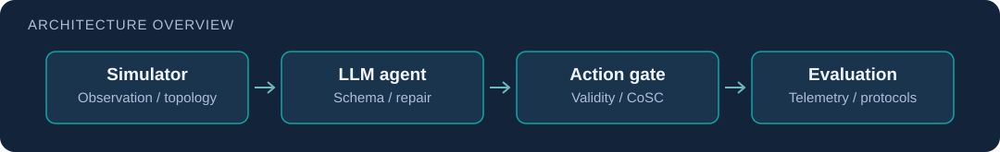

<picture>
  <source media="(max-width: 600px) and (prefers-color-scheme: dark)" srcset="assets/header-mobile-dark.svg">
  <source media="(max-width: 600px)" srcset="assets/header-mobile-light.svg">
  <source media="(prefers-color-scheme: dark)" srcset="assets/header-dark.svg">
  <source media="(prefers-color-scheme: light)" srcset="assets/header-light.svg">
  
</picture>

I’m a **Computer Science graduate** who builds and ships products, from mobile clients and backend services to security tooling and applied AI systems. My focus is **Backend / Full-Stack engineering**, with a strong interest in **Security Engineering and AppSec**.

[LinkedIn](https://www.linkedin.com/in/dor-cohen-ab3a23347/) · [Email](mailto:doric9@gmail.com) · [Software projects](#software-engineering) · [Security & AI](#security-engineering--applied-ai)

## Software Engineering

### 01 · PlanLi Travels

**From idea to published product.** A travel community and trip-planning app released on iOS and Android. I designed and built the mobile experience, Firebase backend, authorization boundaries, tests, releases, and operational tooling.

**React Native / Expo · TypeScript · Firebase · Node.js · GitHub Actions**

<picture>
  <source media="(max-width: 600px)" srcset="assets/planli-mobile.svg">
  
</picture>

[Code & engineering overview](https://github.com/doric2000/PlanLi) · [App Store](https://apps.apple.com/il/app/planli-travels/id6801453067) · [Google Play](https://play.google.com/store/apps/details?id=com.planli.planlitravels) · [Case study](docs/planli.md)

### 02 · PlanLi Schedule

**Constraints into editable shift plans.** A collaborative scheduling system combining staff availability, manager workflows, and CP-SAT optimization. My contributions include monthly planning logic, worker-type management, solver integration, and related tests. Co-built with **Roy Naor, Ofek, and Baruh Ifraimov**.

**React · TypeScript · Node.js / Express · PostgreSQL · Python · OR-Tools**

<picture>
  <source media="(max-width: 600px)" srcset="assets/schedule-mobile.svg">
  
</picture>

[Shared repository](https://github.com/RoyNaor/PlanLi-Schedule) · [My commits](https://github.com/RoyNaor/PlanLi-Schedule/commits?author=doric2000) · [Case study](docs/schedule.md)

### 03 · RADCOM Cyber Classifier

**ML inference behind an asynchronous service.** CSV uploads become queued classification jobs with task IDs, result polling, and downloadable predictions. Co-built with **Baruh Ifraimov**; my work spans classification and the service integration.

**FastAPI · Celery · Redis · Streamlit · scikit-learn / XGBoost · Docker**

<picture>
  <source media="(max-width: 600px)" srcset="assets/radcom-mobile.svg">
  
</picture>

[Code & setup](https://github.com/doric2000/RadcomProject) · [Case study](docs/radcom.md)

## Security Engineering & Applied AI

### 04 · Wireless Threat Detection

**Passive observations into reviewable alerts.** An internship system for Wi-Fi device fingerprinting, lingering-device and suspicious-SSID heuristics, persistent state, and operator monitoring. I built the application around upstream Kismet capture.

**Python · FastAPI · Kismet · SQLite · JavaScript · Docker**

<picture>
  <source media="(max-width: 600px)" srcset="assets/wifi-mobile.svg">
  
</picture>

[Sanitized code & lab setup](https://github.com/doric2000/wifi-threat-detection-portfolio) · [Case study](docs/wifi.md)

### 05 · AI Video Security Pipeline

**Security context around video events.** An internship pipeline that gates Frigate/MQTT events, retrieves evidence clips, coordinates local multimodal inference, and records structured decisions. I built the worker and operator interface around upstream detection and model services.

**Python · MQTT · Frigate · FFmpeg · vLLM / Ollama · Docker**

<picture>
  <source media="(max-width: 600px)" srcset="assets/video-mobile.svg">
  
</picture>

[Sanitized code & integration guide](https://github.com/doric2000/ai-video-security-portfolio) · [Case study](docs/video.md)

### 06 · Autonomous Cyber Defense

**A research extension of an existing simulator and LLM agent.** Co-developed with **Baruh Ifraimov**, extending the work of **Castro et al.** with action validation, structured output handling, telemetry, local model configurations, and reproducible evaluation protocols.

**Python · LLM agents · Ollama · Action gating · Experiment telemetry**

<picture>
  <source media="(max-width: 600px)" srcset="assets/acd-mobile.svg">
  
</picture>

[Fork & contribution map](https://github.com/doric2000/llms-are-acd) · [Case study & evidence limits](docs/acd.md)

## More engineering work

- [Concurrent Systems & Graph Algorithms](https://github.com/doric2000/OS-final-project) — co-built with Baruh Ifraimov: C++ TCP servers, Leader–Follower and Active Object designs, graph algorithms, and profiling artifacts.
- [AMD-Agent](https://github.com/baruhifraimov/AMD-Agent) — co-authored with Baruh Ifraimov: an adaptive malware-detection research project using LightGBM, drift monitoring, and an LLM orchestration layer.
- [Evil Twin Attack & Defense Lab](https://github.com/baruhifraimov/evil-twin-attack-tool) — team project in an authorized lab; my focus included interface integration, scanning, testing, and defense validation.

**How I work:** own features across the stack, make behavior testable, review security boundaries, and follow changes through delivery and operation.

Portfolio reviewed 6 October 2026. Internship copies use synthetic examples. Historical test counts and experimental results are dated and qualified in the linked case studies.
